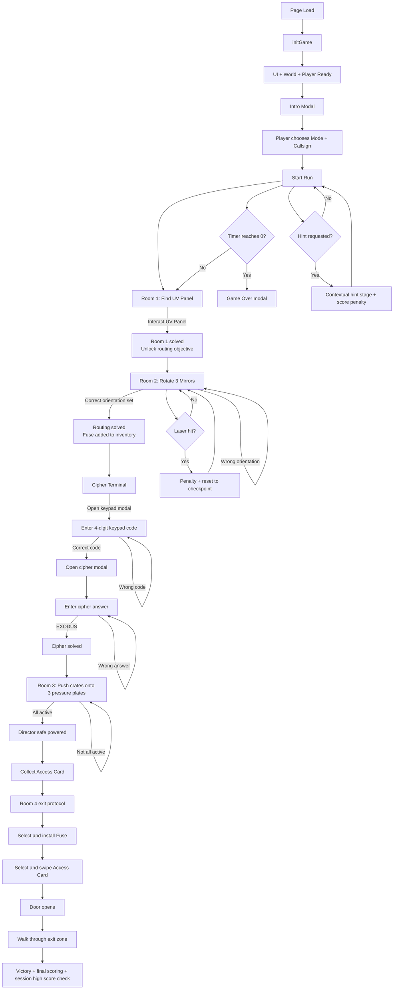

# Escape Room Game Flow

## Winning Flow (With Failure Loops)

## Core Runtime Loop

1. `animate()` runs each frame.
1. If running and no modal: countdown timer ticks, player updates, world updates.
1. World update resolves laser hits, plate activation state, door blocking/opening, exit detection.
1. Main loop reacts with penalties, resets, objective updates, and win/lose modals.

## State Guards That Prevent Invalid Progression

1. Cipher terminal cannot be used until routing is solved.
1. Cipher modal is locked until keypad code is correct.
1. Safe cannot open until cipher solved and all 3 plates are active.
1. Fuse box requires fuse item selected in inventory.
1. Card reader requires access card selected in inventory.
